# Microsoft Graph Security API Sample for ASP.NET 4.6 (REST) Demo V3.0

## Table of contents

- [Introduction](#introduction)
- [Prerequisites](#prerequisites)
- [Register the application](#register-the-application)
- [Grant Admin consent to view Security data](#grant-admin-consent-to-view-security-data)
- [Build and run the sample](#build-and-run-the-sample)
- [Deploy the sample to Azure](#deploy-the-sample-to-azure)
- [Microsoft Graph Security API Sample App v3.0 UI Walkthrough](#Demo-UI-walkthrough)
- [Questions and comments](#questions-and-comments)
- [Additional resources](#additional-resources)

## Introduction

This sample shows how to connect an ASP.NET 4.6 MVC web app using a Microsoft work or school (Azure Active Directory) account to the Microsoft Graph security API to retrieve security Alerts, update an Alert, create Security Actions and retrieve them, subscribe to Alert notifications, and also a sample listener for Alert notifications. It uses SDK and REST calls to interact with the Microsoft Graph API.

The sample uses the [Microsoft Authentication Library (MSAL)](https://www.nuget.org/packages/Microsoft.Identity.Client/) for authentication. The MSAL SDK provides features for working with the [Azure AD v2.0 endpoint](https://azure.microsoft.com/en-us/documentation/articles/active-directory-appmodel-v2-overview) that enables developers to write a single code flow that handles authentication for both work or school (Azure Active Directory) accounts.

## Prerequisites

This sample requires the following:  

  1. [Visual Studio 2015 or higher](https://www.visualstudio.com/en-us/downloads) 

  2. [Microsoft work or school account](https://www.outlook.com) 

  3. [.Net Core SDK v2.2](https://dotnet.microsoft.com/download/thank-you/dotnet-sdk-2.2.104-windows-x64-installer)
   
  4. LTS version of [NodeJS](https://nodejs.org/uk/)

  5. [Angular cli](https://cli.angular.io/) using command `npm install -g @angular/cli`.

## Getting started with sample

 1. Download or clone the Microsoft Graph Security API Sample for ASP.NET 4.6 (REST).

### Register the application

1. Sign into the [Application Registration Portal](https://apps.dev.microsoft.com/) using either your work or school account.

2. Choose **Add an app**.

3. Enter a name for the application, and choose **Create application**.

 > The registration page displays the properties of your app.

4. Copy and save the Application Id, it will be used later. This is the unique identifier for your application.

5. Under **Application Secrets**, choose **Generate New Password**. Copy and save the password from the **New password generated** dialog. 
**Note:** you will not be able to view the secret again in this interface.

   You will need the application ID and password (secret) to configure the MicrosoftGraph_Security_API_Sample app in the next section.

6. Under **Platforms**, choose **Add Platform**.

7. Choose **Web**.

8. Make sure the **Allow Implicit Flow** check box is selected, and enter *http://localhost:55065/* (or another port of your choice) as the Redirect URI.

   The **Allow Implicit Flow** option enables the hybrid flow. During authentication, this enables the app to receive both sign-in information (the id_token) and artifacts (in this case, an authorization code) that the app can use to obtain an access token.

9. Under **Microsoft Graph Permissions**, choose **Delegated Permissions,  Add **SecurityEvents.ReadWrite.All, SecurityActions.ReadWrite.All, IdentityRiskyUser.Read.All, and User.Read.All**. These permissions will allow the sample application to read and modify security events (alerts) / Actions, get Risky Users from Azure AD and to retrieve information about users from Azure Active Directory via the Microsoft Graph API.

10. Choose **Save**.

## Grant Admin consent to view Security data

### Assign Scope (permission)

1. Provide your Administrator the **Application Id** and the **Redirect URI** that you used in the previous steps. The organization’s Azure Active Directory Tenant Administrator is required to grant the required consent (permissions) to the application.
2.	As the Tenant Administrator for your organization, open a browser window and paste the following URL in the address bar (after adding values for TENANT_ID, APPLICATION_ID and REDIRECT_URL):
https://login.microsoftonline.com/TENANT_ID/adminconsent?client_id=APPLICATION_ID&state=12345&redirect_uri=REDIRECT_URL.
> **Note:** Tenant_ID is the same as the AAD Directory ID, which can be found in the Azure Active Directory Blade within [Azure Portal](portal.azure.com). To find your directory ID, Log into [Azure Portal](portal.azure.com) with a tenant admin account. Navigate to “Azure Active Directory”, then “Properties”. Copy your ID under the "Directory ID" field to be used as **TENANT_ID**.
3.	After authenticating, the Tenant Administrator will be presented with a dialog like the following (depending on the permissions the application is requesting)

      >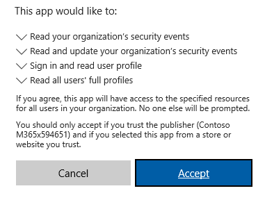

4. By clicking on "Accept" in this dialog, the Tenant Administrator is granting consent to all users of this organization to use this application. Now this application will have the correct scopes (permissions) need to access the Security API, the next section explains how to authorize a specific user within your organization (tenant).
    >**Note:** Because there is no application currently running at the redirect URL you will be receive an error message. This behavior is expected. The Tenant Administrator consent will have been granted by the time this error page is shown.</br>

### Authorize users in your organization to access the Microsoft Graph security API (Assign required Azure role)

To access security data through the Microsoft Graph security API, the client application must be granted the required permissions and when operating in Delegated Mode, the user signed in to the application must also be authorized to call the Microsoft Graph security API.
This section describes how the Tenant Administrator can authorize specific users in the organization.

1. As a Tenant **Administrator**, sign in to the [Azure Portal](https://portal.azure.com).

2. Navigate to the Azure Active Directory blade.

3. Select **Users**.

4. Select a user account that you want to authorize to access to the Microsoft Graph security API.

5. Select **Directory Role**.

6. Select the **Limited Administrator** radio button and select the check box next to **Security administrator** role

     >  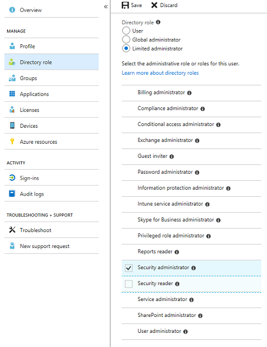

7. Click the **Save** button at the top of the page

Repeat this action for each user in the organization that is authorized to use applications that call the Microsoft Graph security API. Currently, this permission cannot be granted to security groups.

> **Note:** For more details about the authorization flow, read [Authorization and the Microsoft Graph Security API](https://developer.microsoft.com/en-us/graph/docs/concepts/security-authorization).


## Build and run the sample

### Configure and run the sample for **MicrosoftGraph_Security_API_Sample** project (Part 1)

#### Server application
1. Open the ` MicrosoftGraph_Security_API_Sample_V3.0.sln` project. 
    Configurations for server side application are in the `appsettings.<ASPNETCORE_ENVIRONMENT>.json` (e.g. appsettings.Development.json or appsettings.Production.json) files in the project root directory. When you start the application, the settings are automatically read from the file whose name matches the current environment name. The default in the Visual Studio is Development environment. You can add any other environments and settings for them at your discretion. 
    App settings consist of 3 main properties:
    1.	**AzureAd** is a complex-type property for setup auth using Azure Active Directory.
    2.	**UseMockFilters** is a boolean value. If set to true, then the application uses mock data from `mockData.json`. Read more in the 'Caching and mock data' section.
    3.	**CacheTime** is a complex-type property that contains times  in seconds for caching for all actions, that support cache.
2. If you want to run locally, In appsettings.Development.json file, Enter the values for **ClientId** and **ClientSecret** with the application ID and password that you copied during app registration. 
	
#### Client application

3. The client application is located in the `ClientApp` folder. And the settings for it are in the `ClientApp/src/environments` folder. As well as on the server, there can be many different environments and settings for each of them. By default, there are settings for two environments:
    1. `environment.ts` is settings for development environment.
    2. `environment.prod.ts` is the settings that are used when building the production version of the Angular application by default.
4. If you want to run locally, In environment.ts file, Replace **Enter_Your_Appid** with the application ID that you copied during app registration in the fields 'clientId' and 'protectedResourceMap'. 

### Visual studio settings
1. Go to the project properties in visual studio, click on Debug 
    1. Check the checkbox for 'Launch browser at 'swagger'
    2. Add the Environmental variables 
         "CLIENT_ENVIRONMENT" with Value "None", "ASPCORE_ENVIRONMENT" with value "Development"
    3. Set the App URL: **http://localhost:5000** to run the server at port 5000.

  	  >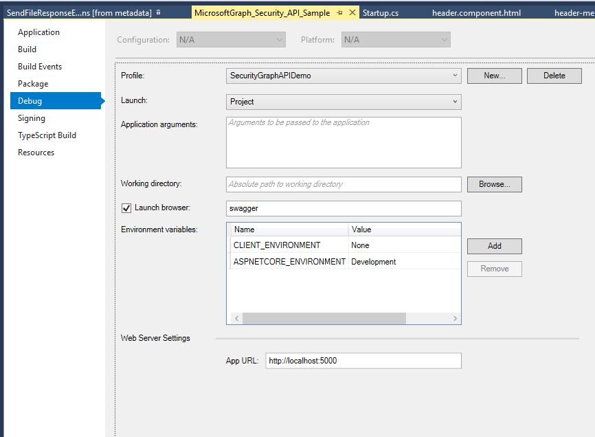  


### Compile and launch app locally

In order to run the application in a local environment, you need to perform the following steps:
1. After following the prerequisites of Installing .Net Core SDK v2.2, NodeJS and Angular CLI, Open the solution file ` MicrosoftGraph_Security_API_Sample_V3.0.sln` and restore Nuget packages for .Net core app by building the solution file in Visual studio (Build solution).
2. Navigate to Client app root directory and  install client dependencies using `npm install`.
3. Run the solution file in Visual Studio (F5) to run the server app.
4. In the client app root directory (ClientApp), Run client app using `npm start` command.

### Configure the sample Notification Listener (Part 2) in the local environment.

### **Set up the ngrok proxy**

Set up the ngrok proxy to check the notifications generated for your subscriptions. This is required if you want to test the sample Notification Listener on localhost. 
You must expose a public HTTPS endpoint to create a subscription and receive notifications from Microsoft Graph. While testing, you can use ngrok to temporarily allow messages from Microsoft Graph to tunnel to a *localhost* port on your computer. 

You can use the ngrok web interface (http://127.0.0.1:4040) to inspect the HTTP traffic that passes through the tunnel. To learn more about using ngrok, see the [ngrok website](https://ngrok.com/).  

1. [Download ngrok](https://ngrok.com/download) for Windows.  

2. Unzip the package and run ngrok.exe.

3. Use the command `ngrok htpp server-port-number`. Replace the *{server-port-number}* placeholder value in the above command with your server port number. By default server app uses port 5000, so command to run ngrok looks like `ngrok http 5000`.

5. Copy the HTTPS URL displayed in the console. You'll use this to configure your notification URL in the sample.

	  >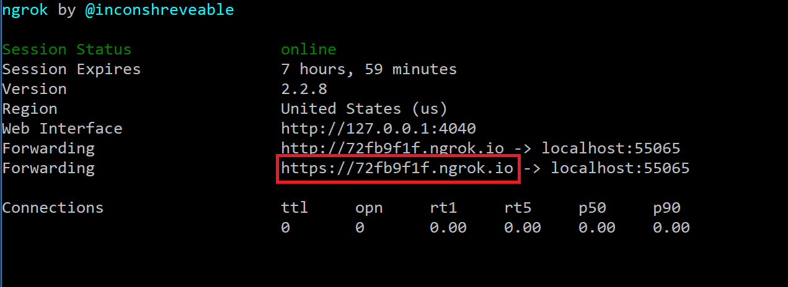

   >Keep the console open while testing. If you close it, the tunnel will also be closed, and you'll need to generate a new URL and update the sample.

See [Hosting without a tunnel](https://github.com/microsoftgraph/nodejs-webhooks-rest-sample/wiki/Hosting-the-sample-without-a-tunnel) and [Why do I have to use a tunnel?](https://github.com/microsoftgraph/nodejs-webhooks-rest-sample/wiki/Why-do-I-have-to-use-a-tunnel) for more information.

### Changes to make in **MicrosoftGraph_Security_API_Sample** project

1. Open the **appsettings.Development.json** file. For the **NotificationUrl** key, replace *Enter_Your_URL* with the HTTPS URL. Keep the */notification/listen* portion. If you're using ngrok, use the HTTPS URL that you copied. The value will look something like this:

   `<add key="ida:NotificationUrl" value="https://0f6fd138.ngrok.io/notification/listen" />`

2. Make sure that the ngrok console is still running, then press F5 to build and run the solution in debug mode. 

   >If you get errors while installing packages, make sure the local path where you placed the solution is not too long/deep. Moving the solution closer to the root drive will resolve this issue.
   
   >If you update any dependencies for this sample, make sure you **do not update** System.IdentityModel.Tokens.Jwt to v5, which is designed for use with .NET Core.

## Deploy the sample to Azure
If you have an Azure subscription, you can publish the sample app to an Azure website. 
The following instructions assume that you've already [registered the sample app](#register-the-application) in the Application Registration Portal.

### Create a web app (website) in the Azure portal

1. Sign into the [Azure Portal](https://portal.azure.com) with your Azure credentials.

2. Choose **New > Web + Mobile > Web App**.

3. Give the website a unique name. Choose a resource group, and click **Create**.

4. Select the new web app in your list of resources.

5. In the Azure portal, under application settings setup new environment variable with name `ASPNETCORE_ENVIRONMENT` and `Production` value (by default). This is necessary so that the application reads correct appsettings file at startup.

6. In order to use Notification in application deployed to Azure, you need to enable **Web sockets** option in application settings of this WebApp in the Azure Portal.

6. Choose **Overview** in the left-hand pane, and then choose **Get publish profile** (or **More > Get publish profile**) from the menu above the web app's Essentials pane.

7. Save the profile locally.

### Publish the MicrosoftGraph_Security_API_Sample app from Visual Studio

1. In Visual Studio, open the MicrosoftGraph_Security_API_Sample application. 
Right-click the **MicrosoftGraph_Security_API_Sample** project node and choose **Publish**.

2. In the Publish dialog, choose **Import**, and choose the publish profile file you downloaded. 

3. On the Connection tab of the Publish dialog, change the *http* protocol to *https* in the Destination URL of your new web app.

4. Copy the Destination URL and click **Publish**. Close the browser window that is opened.

5. In the `appsettings.Production.json` file, replace the **RedirectUri** value to the Destination URL that you copied and the **NotificationUrl** value to the Destination URL, keeping the /notification/listen part. 

      Ex: <add key="ida:RedirectUri" value="https://sampletest.azurewebsites.net/" 

      <add key="ida:NotificationUrl" value="https://sampletest.azurewebsites.net/notification/listen"

6. Choose **View > Other Windows > Web Publish Activity**. 

7. In the Web Publish Activity window, click the **Publish Web** button (it looks like a globe) on the toolbar. This is how you update the published project after you make changes.

### Update the redirect URI in the Application Registration Portal

1. In the [Application Registration Portal](https://apps.dev.microsoft.com), open the application that you registered for the sample (as described in [Register the application](#register-the-application)). 

2. In the Web platform section, replace the *http://localhost:55065/* Redirect URI with the Destination URL of your new MicrosoftGraph_Security_API_Sample web application. 
(Alternatively, you can click **Add Url** and add the Destination URL.)

3. Click **Save**.

The new Azure web application should now be ready to use.

## Caching and mock data

Since the demo application makes many simultaneous calls to the Graph API, the total response time can be long. We use a cache since not all queries can be parallelized as they may depend on results from previous queries. There are two sections in the `appsettings` file that allow you to customize this behavior:
1. `CacheTime`. In this section of settings you can specify the desired time to cache data on our server in seconds. To disable caching for any action, specify 0. MemoryCache used for caching data from Graph API. You can significantly speed up subsequent queries for the same data using caching.
2. `UseMockFilters`. Only set this to true when your tenant doesn't have any alerts and you want to see how the demo UI looks like., This gets data for alerts' and actions' filters from `mockData.json`. This file contains a list of possible providers, categories and other values needed to build filters on the client. If `UseMockFilters` parameter is false, then when the application is started (once), we load the list of categories, providers and other data from the Graph API, and then use them. This method allows you to get more relevant data regarding your tenant from Graph API but significantly increases the time of the first launch of the application.

## Where are list items' order defined in code?

You can change order of displaying lists with properties on the alert details page in the following file:
`ClientApp/src/components/pages/alert-details/alert-details.component.html`. All lists with details are in this file in the following section:
```
    <!-- #region scrollable-detail-list -->
    ...
    <!--#endregion scrollable-detail-list -->
```
You can change the order at any time at your discretion.

## Demo UI walkthrough

1. The start page looks similar to this:
>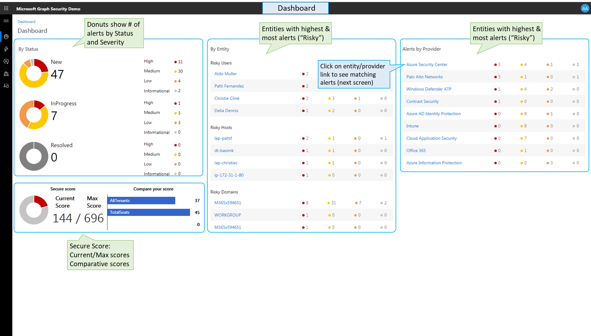

2. You can click the icon to expand the dashboard
>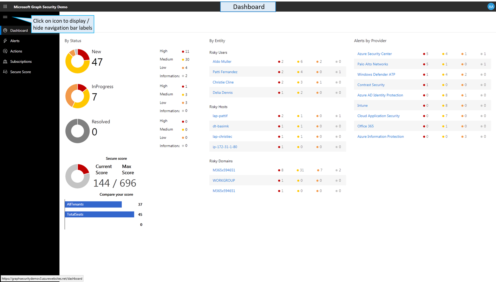

3. Click on any of the clickable links to see the filtered alerts
>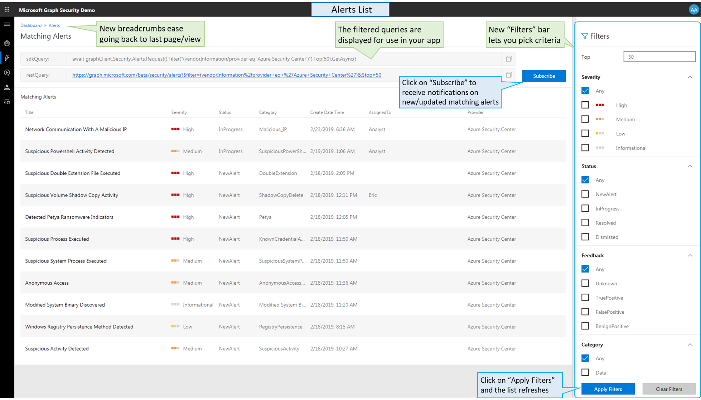

4. Dive deep into a specific alert
>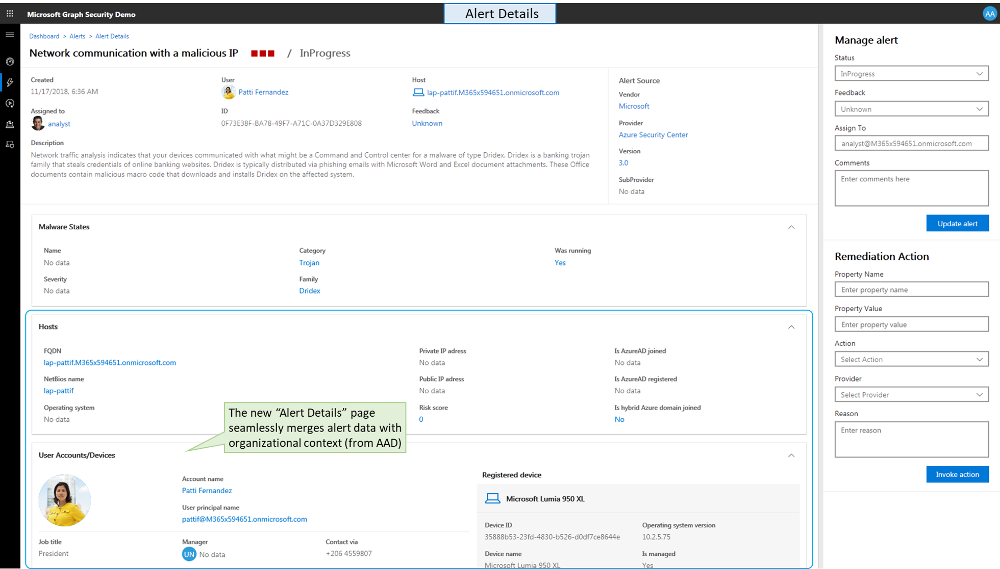

5. Manage the alert
>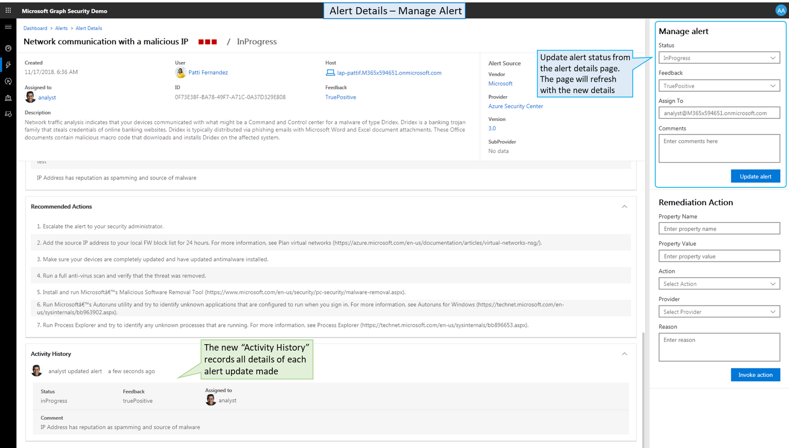

6. Invoke a security action
>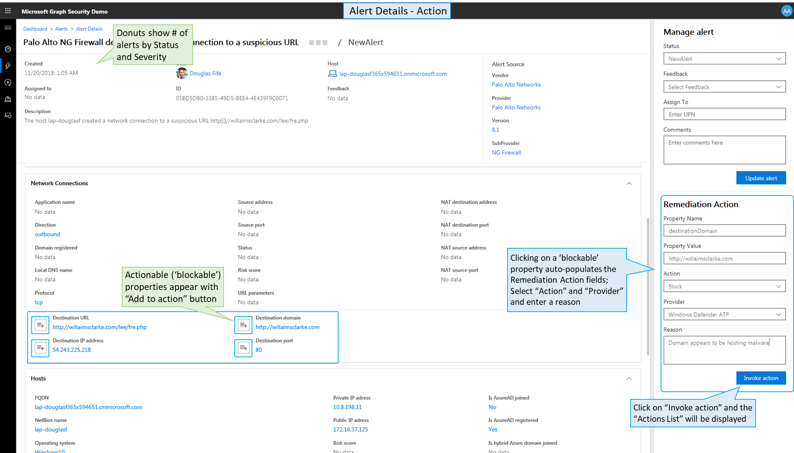

7. List of security actions
>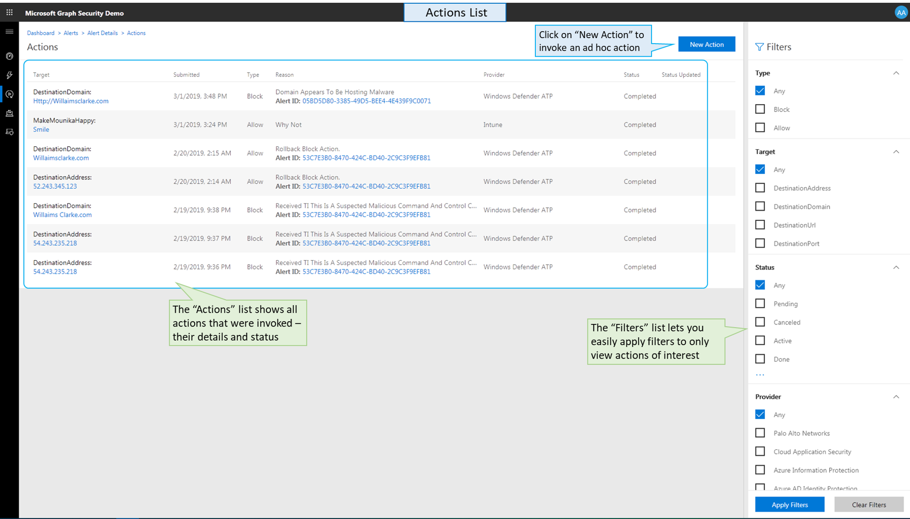

8. List of subscriptions 
>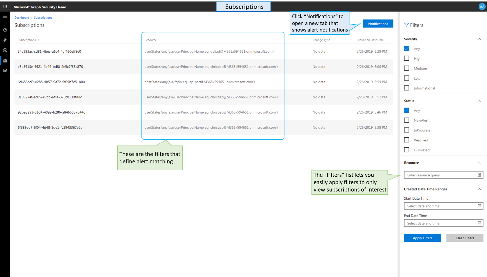

9. Details regarding secure score of the tenant
>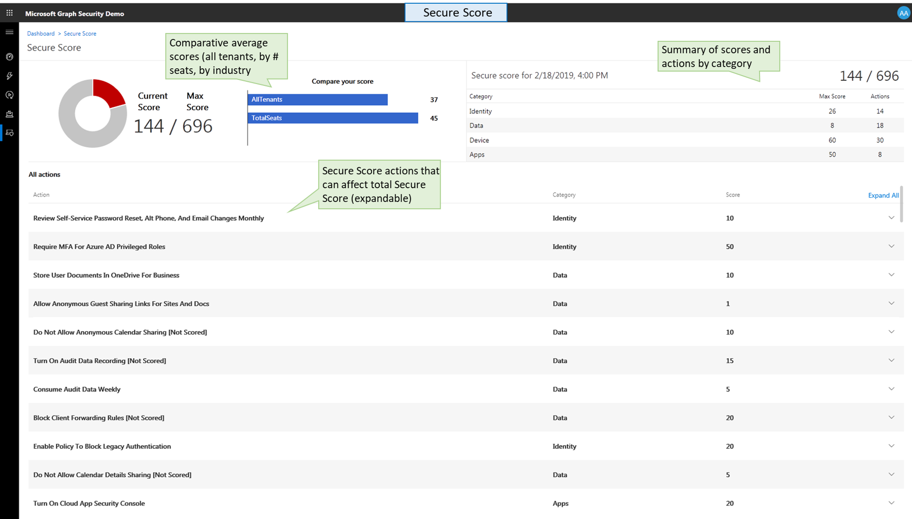

## Questions and comments

We'd love to get your feedback about this sample! 
Please send us your questions and suggestions in the [Issues](https://github.com/microsoftgraph/aspnet-connect-rest-sample/issues) section of this repository.

Your feedback is important to us. Connect with us on [Stack Overflow](https://stackoverflow.com/questions/tagged/microsoftgraph). 
Tag your questions with [MicrosoftGraph].

## Additional resources

- [Microsoft Graph Security API Documentaion](https://aka.ms/graphsecuritydocs)
- [Other Microsoft Graph Connect samples](https://github.com/MicrosoftGraph?utf8=%E2%9C%93&query=-Connect)
- [Microsoft Graph overview](https://graph.microsoft.io)

## Copyright
Copyright &copy; 2018 Microsoft. All rights reserved.